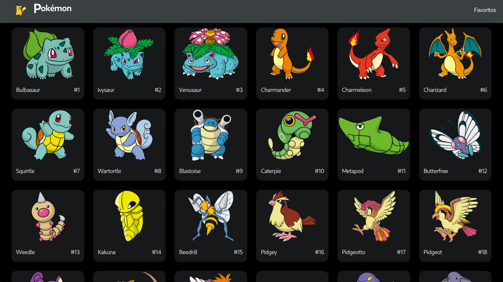

# Pokemon App
## Consulta información relevante de todos los pokemones


### Screenshot




### Ver aplicación

Si quieres ver la aplicación ya en producción puedes verlo [aquí](https://pockemon-next-app.vercel.app/)

Si lo que quieres es usar la aplicación en desarrollo puedes hacerlo ejecutando los siguientes comandos:

```bash
# install dependencies
npm install # or yarn add

# run application
npm run dev # or yarn dev
```

También puedes crear el `build` de producción y ejecutarlo con los comandos

```bash
npm run build # or yarn build

npm start # or yarn start
```
